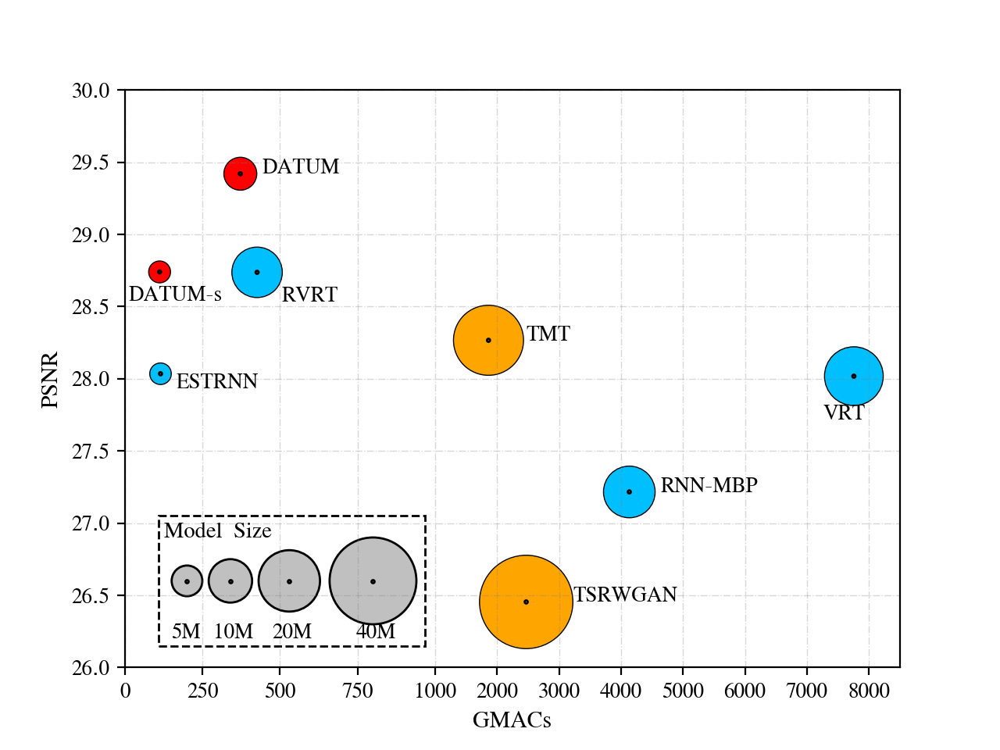

# 【CVPR'2024🔥】Spatio-Temporal Turbulence Mitigation: A Translational Perspective

[Project Page](https://xg416.github.io/DATUM/) | [Pretrained dynamic scene model](https://drive.google.com/file/d/1IClAWZ-9kY5TggmuQGp11_dqOgCOCbjx/view?usp=sharing) | [Pretrained static scene model](https://drive.google.com/file/d/13pJyzXo3ricYIy8WHMAWMxp4crEXUolg/view?usp=sharing)

More instructions will be added within this week

